Section 1
=========

The information presented in this workshop is accurate as of 19 February 2015 and uses the [ORIONE](https://orione.crs4.it/) instance of Galaxy.

Introduction
------------

The purpose of this workshop is to highlight benefits of creating reproducible workflows. We will accomplish this using the Galaxy environment. Galaxy is an open-source, web-based platform for biomedical research. This section of the workshop will walk through a simple sequence annotation pipeline using a public instance of Galaxy.

Step 1: Navigate to ORIONE
--------------------------

### Description ###

We will use a public Galaxy instance hosted by CRS4 ([ORIONE](https://orione.crs4.it/)). The ORIONE instance of Galaxy contains several next-generation sequencing tools, including: *de novo* assembly, sequence alignment, BLAST, and sequence annotation.

### Instructions: ORIONE ###

1. Navigate to [ORIONE](https://orione.crs4.it/).
2. Register for Galaxy by clicking **User** &rarr; **Register**.
3. Ensure you are logged into ORIONE by clicking **User**. The drop-down menu should display your username.

Step 2: Upload Data
-------------------

### Description ###

The starting point of our sequence annotation pipeline is simulated FASTQ reads generated from an *E. coli* plasmid sequence. A plasmid is a small DNA molecule which can replicate independently from the chromosome. We use the *E. coli* O104:H4 pESBL plasmid because it is very small in size. We first need to upload our FASTQ reads file to Galaxy. This can be accomplished in multiple ways:

1. [Upload files from the web](#instructions-upload-from-the-web)
2. [Upload files from your computer](#instructions-upload-local-file)

### Instructions: Upload from the Web ###

Galaxy makes it easy to transfer files directly from one location on the web to another, without requiring you to download the file onto your own computer first. You may want to do this, for example, when you're working with large files from the National Center for Biotechnology Information (NCBI). NCBI hosts several large databases relevant to biotechnology and biomedicine. Some Galaxy instances, such as Galaxy Central, are on high-speed research networks (Internet2 in the US and CANARIE in Canada), connected to institutions like NCBI with a much faster connection than your home or work network.

1. Select **Common Tools** &rarr; **Get Data** &rarr; **Upload File** to open the upload window.

    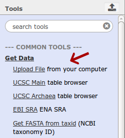

2. Select the **Paste/Fetch data** button which appears in the upload window.

    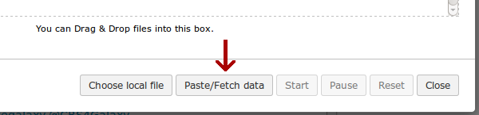

3. Paste the following link into the text box: 

    https://github.com/emarinier/PUBS2015/raw/master/data/reads/Ecoli_O104H4_pESBL.fastq

    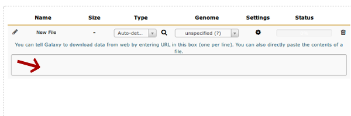
    
4. Click the **Start** button.

    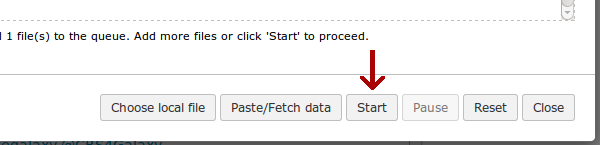
    
5. Close the upload window when complete.
    
6. The uploaded *E. coli* reads should appear in your right-hand **History** panel.

    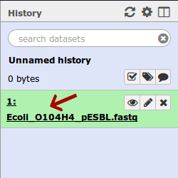    

### Instructions: Upload Local File ###

If the file that you want to work with isn't available on the web, or on NCBI (it's hot off the sequencer), then you'll need to manually upload the file from your computer. This is generally going to be slower than having Galaxy download the file for you.

1. Download the [Ecoli_O104H4_pESBL.fastq](../data/reads/Ecoli_O104H4_pESBL.fastq) file directly to your computer.

2. Select **Common Tools** &rarr; **Get Data** &rarr; **Upload File** to open the upload window.

    

3. Click the **Choose local file** button and locate the file to upload.

    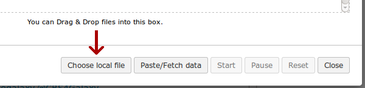

4. Click the **Start** button.

    
    
5. Close the upload window when complete.

6. The uploaded *E. coli* reads should appear in your right-hand **History** panel.

    
    
Step 3: Quality Report
----------------------

### Description ###

Understanding the quality of sequencing reads used in an experiment is important because low-quality reads can have negative or unexpected consequences on the outcome of your workflow. We will assess the quality of our *E. coli* reads using [FastQC](http://www.bioinformatics.babraham.ac.uk/projects/fastqc/), a quality control tool for sequencing data.

### Instructions: FastQC ###

1. Navigate to FastQC at **Common Tools** &rarr; **NGS: Quality control** &rarr; **FastQC:Read QC**.

    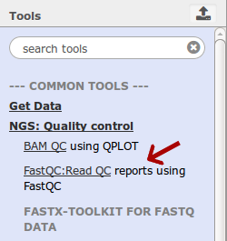

2. Ensure the **Short read data from your current history** parameter contains the uploaded *E. coli* plasmid reads.

    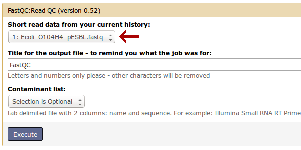

3. Leave the remaining parameters as default.

4. Click the **Execute** button.

    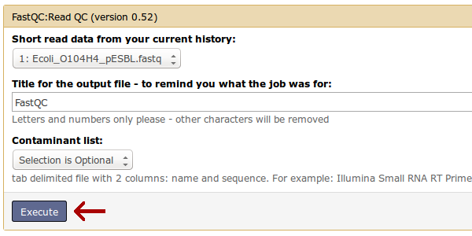
    
5. The FastQC report should appear in your **History**.

    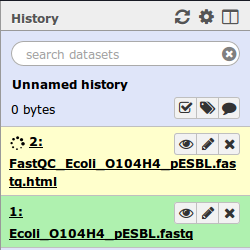

6. When completed, click the **View data** button to view the report.

    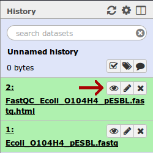
    
### Results: FastQC ###

FastQC will provide several reports indicating the quality of the sequencing reads. This information can be used to inform whether or not the reads will provide meaningful information. We see that our *E. coli* plasmid reads appear to be of good quality. This is because, on average, all of the positions in a sequence read have acceptably high quality scores, as indicated by their position in the high-quality, green region of the graph.
    
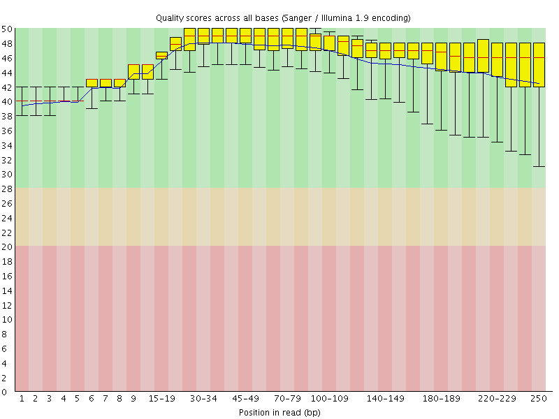

Step 4: Sequence Assembly
-------------------------

### Description ###

Sequence assembly is the process of constructing larger sequences from smaller fragments. We need to assemble our short reads into longer, contiguous sequences before doing sequence annotation. We will use [ABySS](https://github.com/bcgsc/abyss) to assemble our reads.

### Instructions: ABySS ###

1. Navigate to ABySS at **Microbiology** &rarr; **NGS: de novo assembly** &rarr; **Abyss**.

    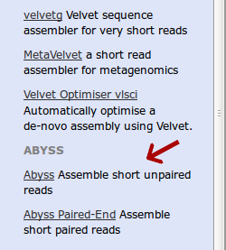

2. Ensure the **Unpaired read sequences** parameter contains the *E. coli* reads.

    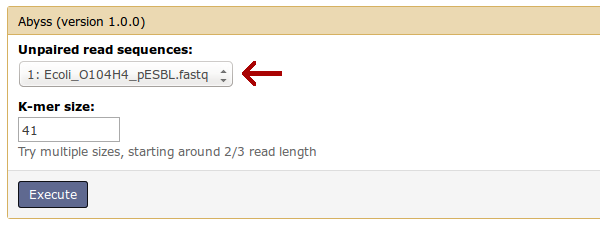

3. Leave the remaining parameters as default.

4. Click the **Execute** button.

    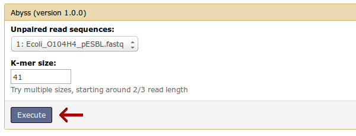

5. The ABySS assembly should appear in your history. 
    
6. When completed, click the **View data** button to view the assembled contigs.

    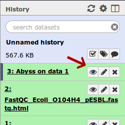

Step 5: Data Manipulation
-------------------------

### Description ###

The ABySS assembly produced several contiguous sequences, or contigs, from many overlapping sequencing reads. These contigs represent a larger consensus region of the sequencing target. In the interest of time, we will only annotate a single, large sequence. We will therefore only annotate the first contig that has a length greater than or equal to 10,000. This will be accomplished using the **Extract contigs** and **Select first** tools.

### Instructions: Extract Contigs ###

1. Navigate to **Microbiology** &rarr; **NGS: post assembly** &rarr; **Extract contigs**.

    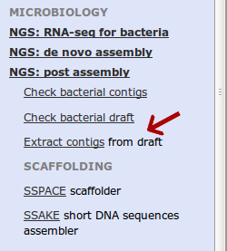
    
2. Ensure the **Draft** parameter contains the output from the ABySS assembly.

    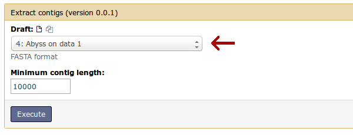

3. Change the **Minimum contig length** parameter to 10000.

    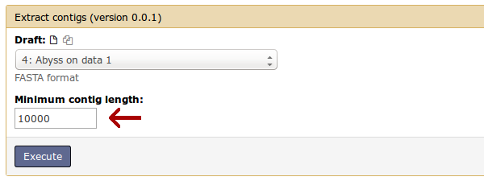
    
4. Click the **Execute** button.

    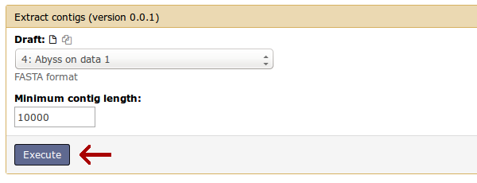
    
5. There should be two extract contig files in your **History**: **contigs** and **high quality contigs**.

### Results: Extract Contigs ###

The **contigs** file contains all contigs with lengths greater than or equal to 10,000 and the **high quality contigs** file contains high quality contigs with lengths greater than or equal to 10,000. However, these files may be identical for our reads. You can view the assembled contiguous sequences by clicking the **View data** button next to the two extract contig files in your **History**.

### Instructions: Select First ###

1. Navigate to **Other Tools** &rarr; **Text Manipulation** &rarr; **Select first**.

    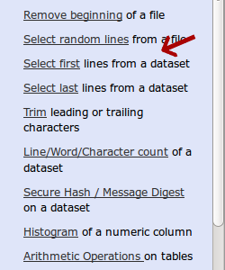

2. Change the **Select first** parameter to 2. This is because our contigs are contained on two lines of text.

    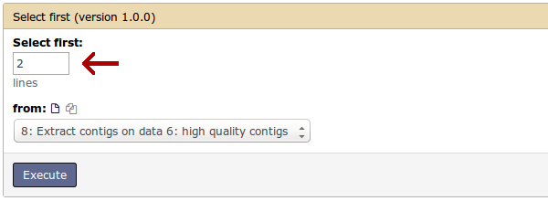

3. Ensure the **from** parameter contains the high quality contigs produced by the extract contigs tool.

    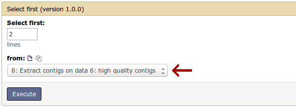

4. Click the **Execute** button.

    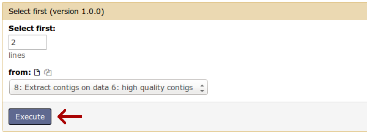
    
5. The task should appear in your **History**.

### Results: Select First ###

The select first operation leaves us with a single contig with length greater than or equal to 10,000. The contig is viewable by clicking the **View data** button next to the item in your **History**.

Step 6: Sequence Annotation
---------------------------

### Description ###

We now have a single contig that we wish to annotate. Sequence annotation describes regions of interest found within a sequence. We will accomplish annotation by comparing the sequence to several known bacterial sequences and assume similar sequences have similar functions. We will use [Prokka](http://www.vicbioinformatics.com/software.prokka.shtml) to annotate our sequence.

### Instructions: Prokka ###

1. Navigate to **Microbiology** &rarr; **Gene annotation** &rarr; **Prokka**. 

    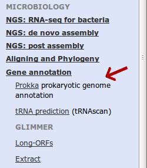

2. Ensure that the **Contigs to annotate** parameter contains the data produced by the select first operation.

    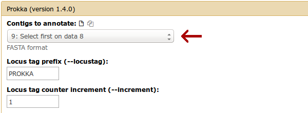

3. Leave the rest of the parameters as default.

4. Click **Execute**.

    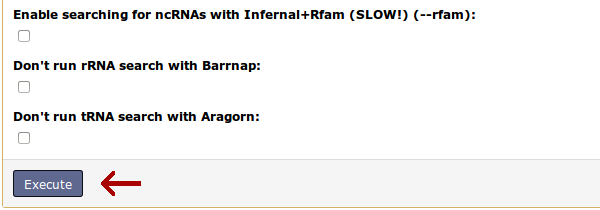

### Results: Prokka ###

There should be several Prokka items added to your history. It may take several minutes for annotations to complete. When completed, you may view the annotations by clicking the **View data** button next to the Prokka files in your history. The genbank (gbk) file produced by Prokka describes annotated regions of interest.

    LOCUS       contig1_S164_E23437_L2327323273 bp   DNA   linear       09-FEB-2015
    DEFINITION  Genus species strain strain.
    ACCESSION   
    VERSION
    KEYWORDS    .
    SOURCE      Genus species
      ORGANISM  Genus species
                Unclassified.
    COMMENT     Annotated using prokka 1.8 from http://www.vicbioinformatics.com.
    FEATURES             Location/Qualifiers
         source          1..23273
                         /organism="Genus species"
                         /mol_type="genomic DNA"
                         /strain="strain"
         CDS             48..1550
                         /locus_tag="PROKKA_00001"
                         /inference="ab initio prediction:Prodigal:2.60"
                         /inference="protein motif:Cdd:COG3451"
                         /codon_start=1
                         /transl_table=11
                         /product="Type IV secretory pathway, VirB4 components"
                         /translation="MSEIQISSAQKNLPFIAYIDKGYSAQGLVQLIRDSLPQERKDEA
                         VGIILSNDPDYTRNLFDVMYGAKKPITPEKNFMSSVLCALCVDTGTGQPCNPGDTRQI
                         INQLIELAFKEYGENNPRLYRASTEELVDSALQDSGLYEKHDAAWWARSTWFEVRDML
                         HNAGYIMAAQRAHYQAMPQLPEVSSMLGHTSLRDVFGTVQRDGSNELLLDYIRRALEQ
                         GHNDYPMISGYTRFMINPETRVIAVDLNNVAGDKTPAGRLKTGIMYLLAGQIAGGDFT
                         LPQYRDEVLKQLPREYHEIALKRINQLDQEVKTKVYDELHNARGIDFIWENLDTQERE
                         QRKFAIRTVLSTQYLRDYPESVLKSANTLWLLRYKPEDIPVLRDNFNVPEFMLKRFLK
                         MPEGPAPDGSGVPVLGVFRVKSGTLARILKFTVGPLELWALNSSPKDSALRKTLTNKL
                         GSVRARKILAENFPRGSATSLIEHRAGQHNSDNVIEELASELIRKQGYNL"

Section 2
---------

This sequence annotation process is developed into a workflow in [Section 2](../Section2/Section2.md). 
