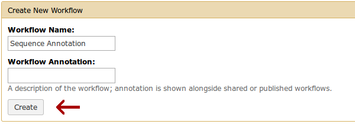

Section 2
=========

The information presented in this workshop is accurate as of 19 February 2015 and uses the [ORIONE](https://orione.crs4.it/) instance of Galaxy.

Introduction
------------

This section of the workshop assumes the reader has completed [Section 1](../Section1/Section1.md). The purpose of this section is to illustrate the creation and execution of reproducible workflows. We will create a workflow for the simple sequence annotation pipeline used in the first section of this workshop.

Step 1: Navigate to ORIONE Workflows
------------------------------------

### Description ###

Galaxy provides a platform for assembling [workflows](http://en.wikipedia.org/wiki/Workflow) comprised of several tools using an intuitive, user-friendly interface. Despite the user-friendly interface, constructing workflows still requires domain-specific understanding of the task, data, and tools that are used in the workflow. Workflows can be shared with other users and run with little difficulty.

### Instructions: ORIONE Workflows ###

1. Navigate to [ORIONE](https://orione.crs4.it/).
2. Ensure you are logged into ORIONE by clicking **User**. The drop-down menu should display your username.
3. Click **Workflow** near the top of the webpage.

Step 2: Create a New Workflow
-----------------------------

### Description ###

We will create a workflow for the sequence annotation task accomplished in the first section of this workshop. This workflow will produce annotations for a sequence assembled from sequencing reads.

### Instructions: Create Workflow ###

1. Click the **Create new workflow** button.

    

2. Name your workflow *Sequence Annotation*.

    

3. The **Workflow Annotation** may remain empty.

4. Click the **Create** button.

    
    
5. Galaxy should automatically load the **Workflow Canvas** editor.

    

Step 3: Construct Workflow
--------------------------

### Description ###

The workflow construction process in Galaxy is very similar to running the tasks individually. However, unlike running the task individually, we're not working with any particular data during workflow construction. We're instead instructing Galaxy on what tasks we would like performed on our data and in what order.

### Instructions: Add Input ###

The data input is the starting point of our workflow. The input lets Galaxy know on which data to start operating.

1. Select **Workflow control** &rarr; **Inputs** &rarr; **Input dataset**.

    

2. An **Input Dataset** box should be added to your workflow canvas.

    
    
### Instructions: Add FastQC ###

1. Select **Common Tools** &rarr; **NGS: Quality control** &rarr; **FastQC:Read QC**.

    
    
2. A **FastQC:Read QC** box should be added to your workflow canvas.

3. The **Input Dataset** box may now be hidden behind the **FastQC:Read QC** box. Organize the boxes with your mouse so they're both visible.

4. Connect the **Input Dataset** &rarr; **output** field with the **FastQC:Read QC** &rarr; **Short read data from your current history** field by clicking and dragging the arrow buttons near the fields.

    
    
5. Leave the **FastQC** parameters as default.

### Instructions: Add ABySS ###

1. Select **Microbiology** &rarr; **NGS: de novo assembly** &rarr; **Abyss**.

    
    
2. An **Abyss** box should be added to your workflow canvas.

3. Connect the **Input Dataset** &rarr; **output** field with the **Abyss** &rarr; **Unpaired read sequences** field.

    

4. Leave the **Abyss** parameters as default.
    
### Instructions: Add Extract Contigs ###

1. Select **Microbiology** &rarr; **NGS: post assembly** &rarr; **Extract contigs**.

    
    
2. An **Extract contigs** box should be added to your workflow canvas.

3. Connect the **Abyss** &rarr; **output (fasta)** field with the **Extract contigs** &rarr; **Draft** field.

    
    
4. Change the **Minimum contig length** parameter to 10000.

    

5. Leave the remaining **Extract contigs** parameters as default.

### Instructions: Add Select First ###

1. Select **Other Tools** &rarr; **Text Manipulation** &rarr; **Select first**.

    
    
2. A **Select first** box should be added to your workflow canvas.

3. Connect the **Extract contigs** &rarr; **hqoutput (fasta)** field with the **Select first** &rarr; **from** field.

    
    
4. Change the **Select first** parameter to 2.

    

5. Leave the remaining **Select first** parameters as default.

### Instructions: Add Prokka ###

1. Select **Microbiology** &rarr; **Gene annotation** &rarr; **Prokka**. 

    
    
2. A **Prokka** box should be added to your workflow canvas.

3. Connect the **Select first** &rarr; **out_file1** field with the **Prokka** &rarr; **Contigs to annotate** field.

    

4. Leave the **Prokka** parameters as default.

### Instructions: Save the Workflow! ###

1. Don't forget to save your workflow!

2. Click the gear button near the top-right of the canvas and select **Save**.

    

### Results: Full Workflow ###

When you've completed, the workflow should look something like the following:

Step 3: Running the Workflow
-----------------------------

### Description ###

With construction complete, we can easily run our sequence annotation workflow. In order to verify the workflow was assembled correctly, we will ensure that the workflow produces the same output as Section 1 when using the same *E. coli* reads.

### Instructions: Run Workflow ###

1. Click **Workflow** at the top of the ORIONE webpage.

2. Click **Sequence Annotation** &rarr; **Run**.

3. Change the **Input Dataset** parameter to previously uploaded *[E. coli](../data/reads/Ecoli_O104H4_pESBL.fastq)* FASTQ reads. These reads should be available in the history from Section 1. Otherwise, you may need to upload the [reads](../data/reads/Ecoli_O104H4_pESBL.fastq) again.

    
    
4. Check the **Send results to a new history** option.

    

5. Leave the remaining parameters as default.

6. Click the **Run Workflow** button.

    
    
7. Click **History options** &rarr; **Saved Histories** to view all saved histories.

8. Click **Sequence Annotation** &rarr; **View** to view your sequence annotation workflow history.

### Results: Run Workflow ###

The workflow may take several minutes to complete. You may view workflow tasks as they complete by clicking on the **View data**  buttons of the history items. When completed, you may view the annotations by clicking the **View data**  button next to the Prokka files in your history. The genbank (gbk) file should match the Prokka genbank file produced from Section 1:

    LOCUS       contig1_S164_E23437_L2327323273 bp   DNA   linear       09-FEB-2015
    DEFINITION  Genus species strain strain.
    ACCESSION   
    VERSION
    KEYWORDS    .
    SOURCE      Genus species
      ORGANISM  Genus species
                Unclassified.
    COMMENT     Annotated using prokka 1.8 from http://www.vicbioinformatics.com.
    FEATURES             Location/Qualifiers
         source          1..23273
                         /organism="Genus species"
                         /mol_type="genomic DNA"
                         /strain="strain"
         CDS             48..1550
                         /locus_tag="PROKKA_00001"
                         /inference="ab initio prediction:Prodigal:2.60"
                         /inference="protein motif:Cdd:COG3451"
                         /codon_start=1
                         /transl_table=11
                         /product="Type IV secretory pathway, VirB4 components"
                         /translation="MSEIQISSAQKNLPFIAYIDKGYSAQGLVQLIRDSLPQERKDEA
                         VGIILSNDPDYTRNLFDVMYGAKKPITPEKNFMSSVLCALCVDTGTGQPCNPGDTRQI
                         INQLIELAFKEYGENNPRLYRASTEELVDSALQDSGLYEKHDAAWWARSTWFEVRDML
                         HNAGYIMAAQRAHYQAMPQLPEVSSMLGHTSLRDVFGTVQRDGSNELLLDYIRRALEQ
                         GHNDYPMISGYTRFMINPETRVIAVDLNNVAGDKTPAGRLKTGIMYLLAGQIAGGDFT
                         LPQYRDEVLKQLPREYHEIALKRINQLDQEVKTKVYDELHNARGIDFIWENLDTQERE
                         QRKFAIRTVLSTQYLRDYPESVLKSANTLWLLRYKPEDIPVLRDNFNVPEFMLKRFLK
                         MPEGPAPDGSGVPVLGVFRVKSGTLARILKFTVGPLELWALNSSPKDSALRKTLTNKL
                         GSVRARKILAENFPRGSATSLIEHRAGQHNSDNVIEELASELIRKQGYNL"

Exercises
---------

There are several exercises for this section. The exercises may be found found [here](Exercises.md). 
